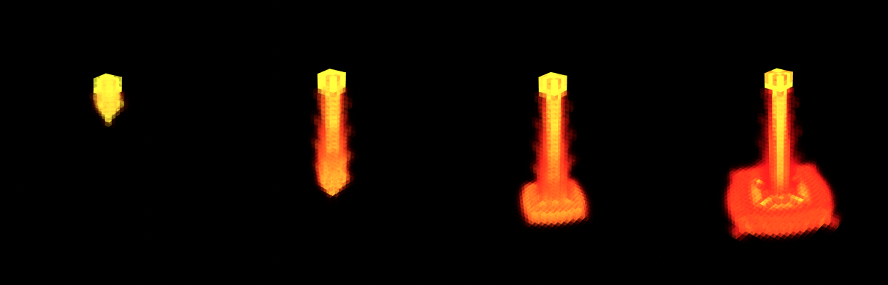

## Introduction

This repo implements the [Stable Fluids paper](https://graphics.stanford.edu/courses/cs448-01-spring/papers/stam.pdf) by Jos Stam.

## Prerequisite installation

On all platforms, we will assume you have installed cmake and a modern c++
compiler on Mac OS X[¹](#¹macusers), Linux[²](#²linuxusers), or
Windows[³](#³windowsusers).

We also assume that you have cloned this repository using the `--recursive`
flag (if not then issue `git submodule update --init --recursive`). 

## Layout

The repo is layed out in the following format

    CMakeLists.txt
    main.cpp
    assignment_setup.h
    include/
      function1.h
      function2.h
      ...
    src/
      function1.cpp
      function2.cpp
      ...
    data/
      ...

The `CMakeLists.txt` file setups up the cmake build routine for this repo.

The `main.cpp` file is where we put the code to execute and draw the simulation.
The code in this file uses the helper functions from `src/`.

The `src/` directory contains helper functions for the running the fluid simulation. 

The `include/` directory contains header files for the functions in `src/`

The `data/` directory contains a cube mesh which is used to help render 
the fluid simulation (as the fluid is represented by a collection of cubes).

## Running the simulation

Run the following commands to create a build directory and to also create the 
makefile for building the simulation.

    mkdir build
    cd build
    cmake .. -DCMAKE_BUILD_TYPE=Release

If you are using Mac or Linux, then issue:

    make

If you are using Windows, then running `cmake ..` should have created a Visual Studio solution file
called `stable-fluids.sln` that you can open and build from there. Building the project will generate an .exe file.

Once built, you can execute the assignment from inside the `build/` using 

    ./stable-fluids

In the original main.cpp files provided, you may change the lava_colour_scale variable to true to
run the simulation with the red colour scale. 

Alternatively if you'd to run the simulation for the banner image of the paper please rename main_lava.cpp
to main.cpp and recompile.

## Warning
When you rotate the camera too much to one side, the simulation may start to disappear. 
This is due to some issues with the lighting in libigl (which we could not figure out how to fix) and not the actual simulation.

## Report
[report.pdf](https://github.com/wenqinYe/fluid-sim/blob/main/report.pdf)

## Video
[https://www.youtube.com/watch?v=axlODAGJxrQ](https://www.youtube.com/watch?v=axlODAGJxrQ)
